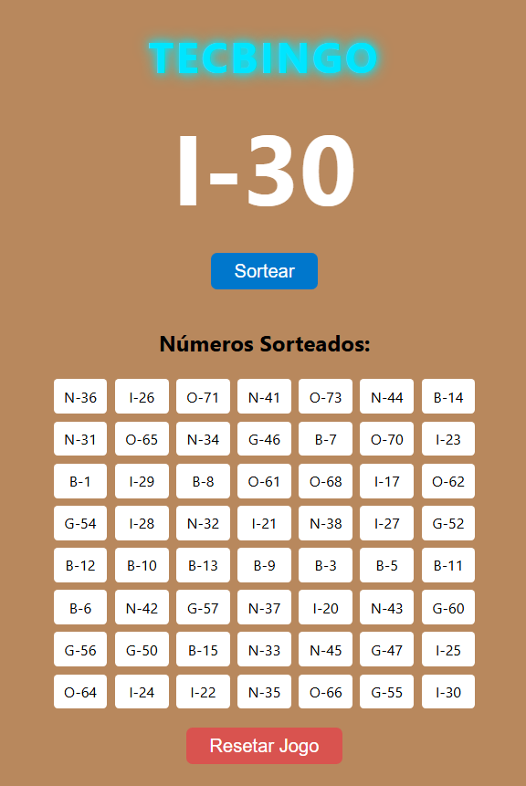

# 🎱 Tec-Bingo
Sorteador de números de bingo


## 📦 Funcionalidades
- Sorteia números de 1 a 75 sem repetições.
- Associa cada número à sua respectiva letra B-I-N-G-O.
- Exibe o número sorteado com destaque.
- Lista o histórico dos números sorteados.
- Permite resetar o jogo.
- Bloqueia atualização da página via F5 e Ctrl+R.

## 🛠️ Como rodar
1. Clone este repositório:
   ```bash
   git clone https://github.com/seu-usuario/seu-repo.git
